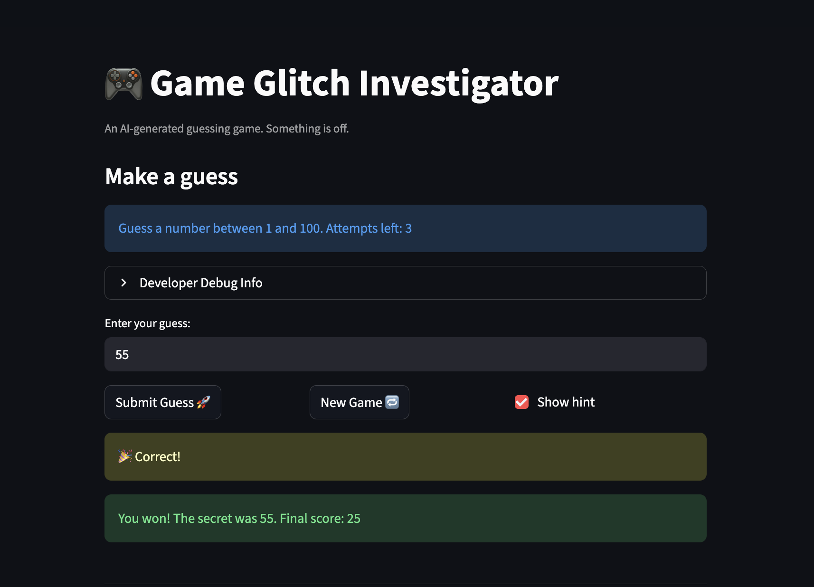

# 🎮 Game Glitch Investigator: The Impossible Guesser

## 🚨 The Situation

You asked an AI to build a simple "Number Guessing Game" using Streamlit.
It wrote the code, ran away, and now the game is unplayable. 

- You can't win.
- The hints lie to you.
- The secret number seems to have commitment issues.

## 🛠️ Setup

1. Install dependencies: `pip install -r requirements.txt`
2. Run the broken app: `python -m streamlit run app.py`

## 🕵️‍♂️ Your Mission

1. **Play the game.** Open the "Developer Debug Info" tab in the app to see the secret number. Try to win.
2. **Find the State Bug.** Why does the secret number change every time you click "Submit"? Ask ChatGPT: *"How do I keep a variable from resetting in Streamlit when I click a button?"*
3. **Fix the Logic.** The hints ("Higher/Lower") are wrong. Fix them.
4. **Refactor & Test.** - Move the logic into `logic_utils.py`.
   - Run `pytest` in your terminal.
   - Keep fixing until all tests pass!

## 📝 Document Your Experience

**Game Purpose:**
A Streamlit-based number guessing game where players attempt to guess a randomly selected secret number within a difficulty-based range (Easy: 1-20, Normal: 1-100, Hard: 1-500). Players have limited attempts and earn points based on how quickly they solve it. The game demonstrates Streamlit state management and provides visual feedback ("Go Higher"/"Go Lower") to guide guesses.

**Bugs Found:**
1. **Difficulty Range Bug** - Hard difficulty returned range (1, 50), which is narrower than Normal (1, 100), making Hard easier to guess instead of harder.
2. **Submit Button Bug** - The attempt counter incremented BEFORE validating user input, wasting attempts when players entered invalid input (letters, decimals, empty strings).
3. **Secret Number Instability** - The secret number changed on every page rerun because `random.randint()` was called without Streamlit session state preservation.

**Fixes Applied:**
1. **Difficulty Range Fix** - Updated `get_range_for_difficulty()` in `logic_utils.py` to return (1, 500) for Hard difficulty, making the range appropriately harder than Normal.
2. **Submit Button Fix** - Moved `st.session_state.attempts += 1` to AFTER input validation in `app.py`, so only valid guesses consume an attempt.
3. **Session State Fix** - Added Streamlit session state initialization checks (`if "secret" not in st.session_state:`) to preserve the secret number across page reruns.

**Testing & Verification:**
- Refactored game logic into `logic_utils.py` for testability
- All 4 pytest tests pass (test_winning_guess, test_guess_too_high, test_guess_too_low, test_check_guess_returns_tuple_with_message)
- Manual testing confirmed: invalid inputs no longer waste attempts, Hard difficulty produces larger numbers than Normal, and secret persists across submit clicks

## 📸 Demo



## 🧪 Test Results

All pytest tests pass successfully:

```
============================= test session starts ==============================
platform darwin -- Python 3.13.11, pytest-9.0.2, pluggy-1.5.0
rootdir: /Users/avnigirish/Documents/ai110-module1show-gameglitchinvestigator-starter
collected 4 items

tests/test_game_logic.py::test_winning_guess PASSED                      [ 25%]
tests/test_game_logic.py::test_guess_too_high PASSED                     [ 50%]
tests/test_game_logic.py::test_guess_too_low PASSED                      [ 75%]
tests/test_game_logic.py::test_check_guess_returns_tuple_with_message PASSED [100%]

============================== 4 passed in 0.01s ===============================
```

✅ All game logic functions validated through automated testing

## 🚀 Stretch Features

- [x] **Challenge 1: Advanced Edge-Case Testing** - Completed with 4 passing pytest tests covering winning condition, too high/low feedback, and return value validation
